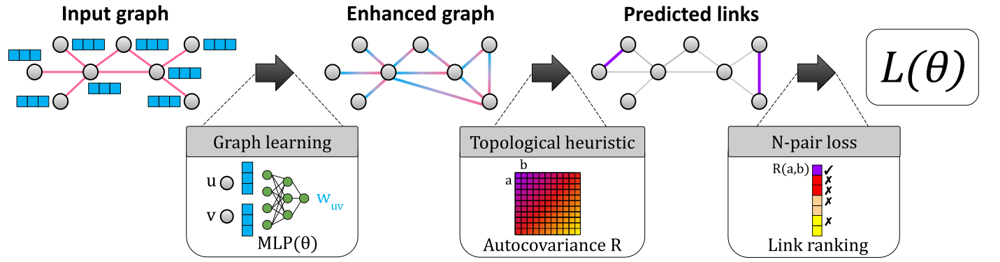

# Link Prediction without Graph Neural Networks

This repository is the reference implementation of Gelato, a simpler, more accurate, and more efficient alternative to GNNs for link prediction. It is described in the following paper:
<br/>
> Link Prediction without Graph Neural Networks.<br>
> Anonymous Author(s).<br>
> Submitted to Eleventh International Conference on Learning Representations (ICLR 2023). 
> <Insert paper link>



## Requirements

The easiest way to install the dependencies is via [conda](https://conda.io/projects/conda/en/latest/user-guide/install/index.html). Once you have conda installed, run this command:

```setup
conda env create -f environment.yml
```

Alternatively, you can manually install [pytorch](https://pytorch.org/get-started/locally/) (version 1.11.0) and [pytorch_geometric](https://pytorch-geometric.readthedocs.io/en/latest/notes/installation.html) (version 2.0.4) for the dependencies. 

All our experiments are run in an a2-highgpu-1g node of the [Google Cloud Compute Engine](https://cloud.google.com/compute) with one NVIDIA A100 GPU. 

## Training

To train Gelato for the Photo dataset with the default hyperparameters, run this command:

```train
python src/train.py --dataset Photo
```

The trained model is saved under `data/{dataset}/model/`. You can check other available training options with:

```train_option
python src/train.py --help
```

## Evaluation

To evaluate the trained model (with the default hyperparameters) for the Photo dataset in terms of AP, precision@k, and hits@k under _unbiased testing_, run this command:

```eval
python src/eval.py --dataset Photo
```

which should return a AP score of 26.26% and the following precision and hits scores (in percentage):

|           | @10%  | @20%  | @30%  | @40%  | @50%  | @60%  | @70%  | @80%  | @90%  | @100% |
|:---------:|:-----:|:-----:|:-----:|:-----:|:-----:|:-----:|:-----:|:-----:|:-----:|:-----:|
| Precision | 72.88 | 61.38 | 54.18 | 49.10 | 44.54 | 41.23 | 38.40 | 36.11 | 33.93 | 32.08 |

|           | @25   | @50   | @100  | @200  | @400  | @800  | @1600 | @3200 | @6400 |
|:---------:|:-----:|:-----:|:-----:|:-----:|:-----:|:-----:|:-----:|:-----:|:-----:|
| Hits      | 1.52  | 2.07  | 3.11  | 5.35  | 8.07  | 11.50 | 16.02 | 22.01 | 29.46 |

You can check other available evaluation options with:

```eval_option
python src/eval.py --help
```


## Pre-trained Models

The pretrained models (with random seed set to 1) for the five datasets in the paper are provided in `data/{dataset}/pretrained/`. Their tuned hyperparameters can be found in `src/experiment.py`. 

## Results

Gelato achieves state-of-the-art performance in link prediction. To reproduce our main results in Table 2 of the paper (mean ± std AP with random seeds ranging from 1 to 10) as well as precision@k and hits@k results, run the following command for the five datasets:

```experiment
python src/experiment.py --dataset {dataset}
```
This gives you the following AP results (in percentage):

|           | Cora        | CiteSeer    | PubMed      | Photo        | Computers    |
|:---------:|:-----------:|:-----------:|:-----------:|:------------:|:------------:|
| AP        | 3.90 ± 0.03 | 4.55 ± 0.02 | 2.88 ± 0.09 | 25.68 ± 0.53 | 18.77 ± 0.19 |


